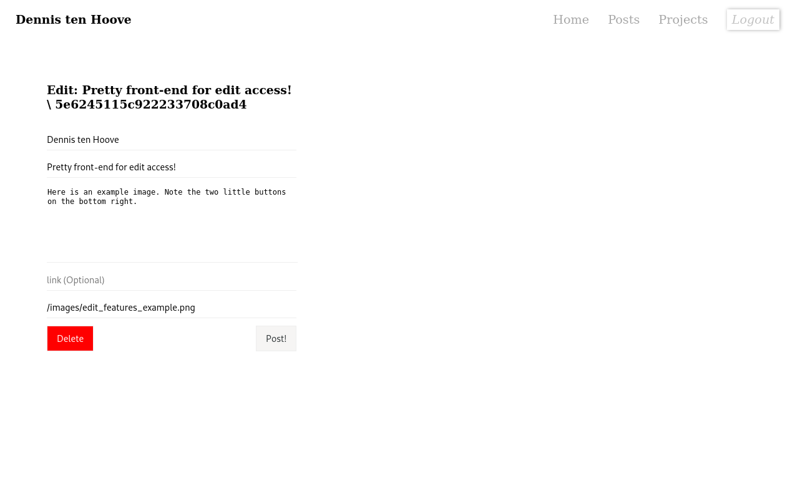

### My personal blog
A simple blog

# Getting it running
### Usage
1. Check server settings at line 24 in app.js
2. `npm install`
3. `node app.js`

### Mongodb
Make sure you have Mongodb installed and running on Localhost.

### Credit images
See `public/images/image_sources`

# Examples
### Pictures

