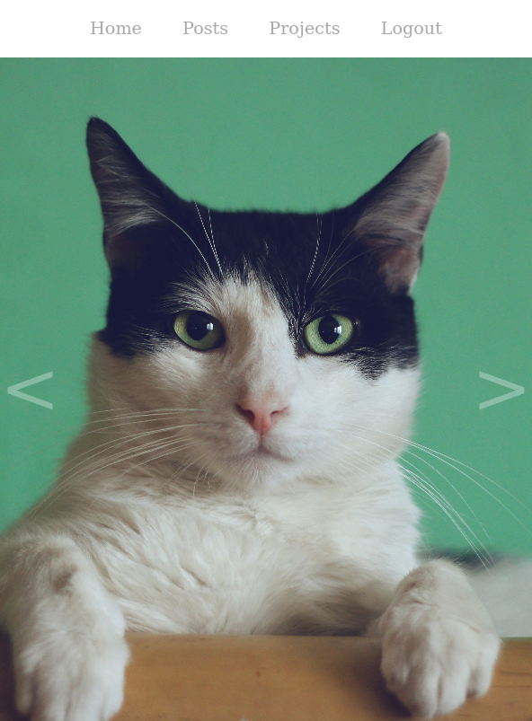

### My personal blog
A simple blog

# Getting it running
### Usage
- `npm install`
- `node app.js`

### Mongodb
Make sure you have Mongodb installed and running on Localhost.

# Examples
### Pictures

